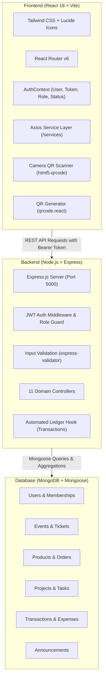

# Skyline Student Association (SSA) - Unified Club Management Platform
## Project Overview & System Blueprint

---

## 1. Executive Summary

The **Skyline Student Association (SSA)** platform is an all-in-one digital backbone designed to replace the fragmented, manual, and error-prone tools university student organizations typically struggle with. 

Currently, campus clubs run on an uncoordinated patchwork:
* Member sign-ups are tracked in scattered spreadsheets.
* Event tickets are sold at the door for cash in envelopes.
* Budgets live in paper notebooks and chat groups.
* Crucial announcements get buried in noisy WhatsApp threads.
* Volunteer reimbursements require chasing crumpled paper receipts.

This platform unifies **Members, Events, Merchandise, Volunteer Projects, and Treasury** into a single, cohesive full-stack web application.

---

## 2. The 6 Real-World Semester Scenes & Our Solutions

The application is built to directly solve the 6 realistic campus club scenes described in the challenge brief:

```
┌────────────────────────────────────────────────────────────────────────────────────────────────┐
│                              THE 6 SEMESTER SCENES MAPPED TO FEATURES                          │
├─────────────────────────┬───────────────────────────────┬──────────────────────────────────────┤
│ Scene from Campus Life  │ The Real-World Pain Point     │ How the Platform Solves It           │
├─────────────────────────┼───────────────────────────────┼──────────────────────────────────────┤
│ 1. A New Student Joins  │ Sign-ups on paper at campus   │ • Instant online signup & dues flow  │
│                         │ tables; lost dues; nobody     │ • Digital Member ID with scannable QR│
│                         │ knows who has active perks.   │ • Auto renewal reminder alerts       │
│                         │                               │ • Automatic discount entitlements    │
├─────────────────────────┼───────────────────────────────┼──────────────────────────────────────┤
│ 2. Spring Gala Tickets  │ Door bottlenecks; cash missing│ • Online tiered ticket booking       │
│                         │ printed paper lists; unknown  │ • Dynamic Member vs. Non-Member rates│
│                         │ attendance or profit.         │ • Sub-second QR Camera Door Scanner  │
│                         │                               │ • Live turnout & revenue analytics   │
├─────────────────────────┼───────────────────────────────┼──────────────────────────────────────┤
│ 3. Announcing Meetings  │ WhatsApp spam; missed dates;  │ • Centralized public notice board    │
│                         │ new members have no history.  │ • 1-click email broadcast to members │
│                         │                               │ • Searchable permanent archive       │
├─────────────────────────┼───────────────────────────────┼──────────────────────────────────────┤
│ 4. Ordering Club Hoodies│ Size confusion on scrap paper;│ • Matrix catalog (Sizes S-XXL, Color)│
│                         │ stock overselling; chasing    │ • Live inventory stock subtraction   │
│                         │ money after ordering.         │ • Upfront online ordering & payment  │
│                         │                               │ • Pickup status pipeline tracker     │
├─────────────────────────┼───────────────────────────────┼──────────────────────────────────────┤
│ 5. Planning a Fundraiser│ Volunteer tasks stuck in      │ • Dedicated project workspace        │
│    (Bake Sale)          │ someone's head or chat groups;│ • Interactive 3-column Kanban board  │
│                         │ unclear supplies checklist.   │ • Volunteer task assignments & dates │
│                         │                               │ • At-a-glance initiative progress    │
├─────────────────────────┼───────────────────────────────┼──────────────────────────────────────┤
│ 6. Treasurer Closing    │ Notebook math; shoe-box of    │ • Automated inflow ledger (dues,     │
│    the Books            │ receipts; missing balances;   │   tickets, merch revenue auto-logged)│
│                         │ difficult handover to next    │ • Volunteer receipt upload & approval│
│                         │ leadership team.              │ • Real-time P&L / cash balance cards │
└─────────────────────────┴───────────────────────────────┴──────────────────────────────────────┘
```

---

## 3. System Architecture & Tech Stack

The application is built on a clean **MERN stack (JavaScript)** without heavy enterprise frameworks, ensuring speed, maintainability, and responsiveness:



### Core Technologies
* **Frontend:** React 18, Vite, Tailwind CSS, Lucide React, React Router DOM v6
* **Backend:** Node.js, Express.js (REST API prefixed with `/api`)
* **Database:** MongoDB with Mongoose ODM
* **Authentication:** JWT (JSON Web Tokens) + bcryptjs password hashing
* **Hardware/Sensors:** Web camera QR scanning via `html5-qrcode` & QR generation via `qrcode.react`

---

## 4. User Roles & Contextual Permission Model

Access control is partitioned into two dimensions: **Global Roles** (what positions you hold in the club) and **Membership Status** (whether dues have been paid):

```
                               ┌────────────────────────────────┐
                               │          GLOBAL ROLES          │
                               ├────────────────────────────────┤
                               │  student                       │
                               │  volunteer                     │
                               │  treasurer                     │
                               │  officer                       │
                               └────────────────┬───────────────┘
                                                │
                 ┌──────────────────────────────┴──────────────────────────────┐
                 ▼                                                             ▼
    ┌─────────────────────────┐                                   ┌─────────────────────────┐
    │    MEMBERSHIP STATUS    │                                   │ CONTEXTUAL DELEGATION   │
    ├─────────────────────────┤                                   ├─────────────────────────┤
    │ none                    │                                   │ Event Manager:          │
    │ active                  │                                   │ A user assigned to an   │
    │ expired                 │                                   │ event's managers array  │
    └─────────────────────────┘                                   │ has admin rights on     │
    Controls:                                                     │ THAT event only.        │
    • Member ticket discount                                      └─────────────────────────┘
    • Merch checkout access
    • Digital QR membership card
```

### The 4 Global Roles
1. **Student (Default):** Can browse upcoming events, merch catalog, and public announcements. Can sign up and pay dues.
2. **Volunteer:** Member with operational permissions. Can use the Door QR Scanner, be assigned to Kanban tasks, move their own tasks to "Done", and submit expense claims.
3. **Treasurer:** Financial executive. Full access to the Treasury dashboard, manual cash recording, and the expense reimbursement review queue (Approve / Reject / Reimburse).
4. **Officer:** Full club administrator. Can create events, manage member roles, oversee inventory, publish announcements, and assign event managers.

### The Scoped Role: Event Manager
* To prevent bottlenecks when multiple events run simultaneously, an Officer can delegate one or more club members to be an **Event Manager** for a specific event via `event.managers: [ObjectId]`.
* **On that specific event:** The manager can edit event information, view and export the attendee list, scan tickets at the door, and manage linked project tasks.
* **On other events & global views:** They remain a standard member and cannot access the member directory or club treasury.

---

## 5. Domain Features Walkthrough

### 1. Membership & Digital Identity
* **Self-Service Joining:** Web registration capturing student ID, major, grad year, and instant dues payment simulation ($25/year).
* **Virtual Membership Card:** Dynamic digital ID badge rendering user details, active date range, and an encrypted QR code for instant member verification.
* **Renewal Engine:** Displays renewal prompts for expired members with one-click payment.
* **Officer Directory:** Searchable, filterable table of all members with role promotion controls and simulated renewal reminder blasts.

### 2. Events & Fast Door Ticketing
* **Dynamic Event Cards:** Standardized yet versatile layout featuring capacity meters, category tags (*Gala*, *Fundraiser*, *Meeting*, *Workshop*, *Social*), and sold-out flags.
* **Dual-Tier Pricing:** Automatically detects active membership to display discounted member rates vs. non-member guest rates.
* **Digital Ticket Generation:** Instant issuance of unique ticket codes (`TKT-2026-XXXX`) with scannable QR codes.
* **Sub-Second Door Check-In:** Dedicated camera scanner page validating tickets in real-time with visual and sound feedback (Green = Valid, Yellow = Already Used, Red = Invalid) plus a manual fallback entry box.

### 3. Club Merchandise & Variant Inventory
* **Apparel Matrix:** Products support matrix variants (Sizes: XS, S, M, L, XL, XXL; Colors) with separate stock tracking per variant.
* **Live Stock Guard:** Prevents overselling by disabling sizes that reach 0 stock and validating inventory at checkout.
* **Member Ordering:** Upfront payment and instant order number (`ORD-2026-XXXX`).
* **Pickup Pipeline:** Transparent fulfillment statuses: `Placed` → `Confirmed` → `Ready for Pickup` → `Collected`.

### 4. Volunteer Projects & Kanban Task Boards
* **Initiative Workspace:** Fundraisers (e.g. Bake Sale) and large events have dedicated task workspaces.
* **Visual Kanban:** 3 columns (*To Do*, *In Progress*, *Done*) with task priority badges (*Low*, *Medium*, *High*), due dates, and supplies checklists.
* **Role Scoped Interactions:** Volunteers can advance tasks assigned to them; Officers/Event Managers can create, edit, reassign, or delete any task.

### 5. Automated Treasury & Expense Reimbursement
* **Automated Inflow Recording:** Dues payments, ticket sales, and merch purchases automatically write positive entries to the `Transaction` ledger with source references.
* **Volunteer Expense Claims:** Volunteers upload receipts, specify category (*Supplies*, *Food*, *Transport*, *Venue*), amount, and linked project.
* **Treasurer Review Queue:** Treasurers review claims, view uploaded receipt images, and either approve or reject with a stated reason.
* **Reimbursement Payout:** Marking an approved claim as "Reimbursed" automatically creates an expense entry in the ledger and updates net cash balance.
* **Executive Dashboard:** Live cards showing **Total Inflow**, **Total Outflow**, **Net Cash Balance**, and visual charts breaking down revenue streams.

### 6. Official Announcements Hub
* **Broadcast Board:** Chronological feed of official announcements tagged by priority (*Meeting*, *Deadline*, *Update*, *Urgent*).
* **Mass Communication Simulation:** Officers can toggle "Send email blast to all active members" upon publishing, ensuring no member misses updates.

---

## 6. How the Documentation is Structured

The `/context` folder contains all contracts needed for development:
* [`00_PROJECT_OVERVIEW.md`](file:///Users/khushpatel/Desktop/odoo-project/context/00_PROJECT_OVERVIEW.md) — This document (high-level vision, problem breakdown, architecture).
* [`01_PROJECT_RULES.md`](file:///Users/khushpatel/Desktop/odoo-project/context/01_PROJECT_RULES.md) — Coding conventions, folder tree, standard API envelope, Tailwind theme, env vars.
* [`02_DATABASE_SCHEMAS.md`](file:///Users/khushpatel/Desktop/odoo-project/context/02_DATABASE_SCHEMAS.md) — Complete Mongoose model definitions, enums, relationships, and business rules.
* [`03_API_ENDPOINTS.md`](file:///Users/khushpatel/Desktop/odoo-project/context/03_API_ENDPOINTS.md) — Every REST endpoint with exact request/response JSON payloads and validation rules.
* [`04_PAGES_AND_COMPONENTS.md`](file:///Users/khushpatel/Desktop/odoo-project/context/04_PAGES_AND_COMPONENTS.md) — Screen wireframes, conditional rendering rules, 16 reusable UI widgets, and route tree.
* [`05_WORK_DIVISION.md`](file:///Users/khushpatel/Desktop/odoo-project/context/05_WORK_DIVISION.md) — Modular work packages, prompt templates for AI assistants, seed data spec, and demo script.
* [`PROGRESS_TRACKER.md`](file:///Users/khushpatel/Desktop/odoo-project/PROGRESS_TRACKER.md) — Live checkable roadmap showing what is completed, in progress, and remaining.
