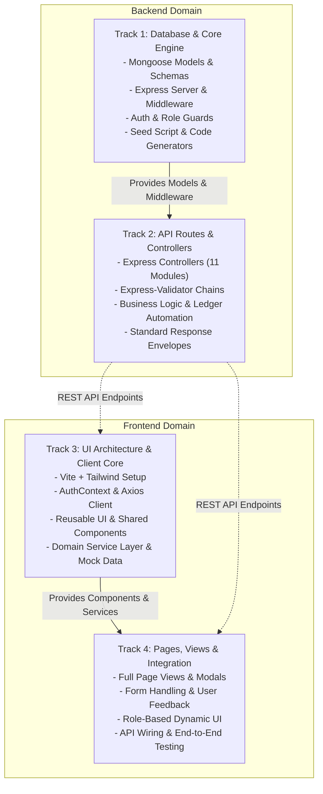
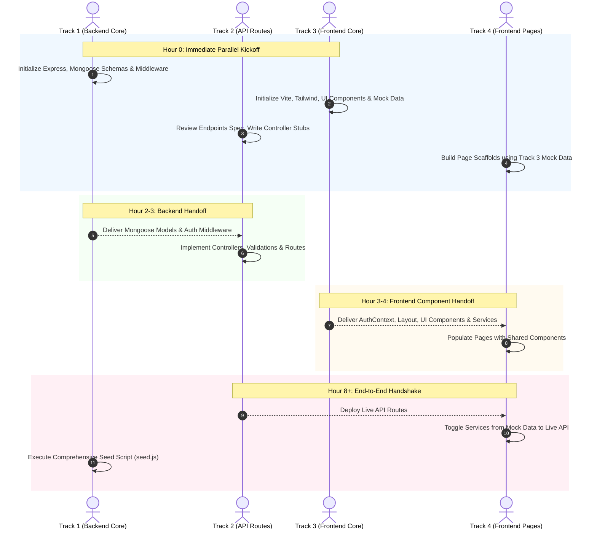
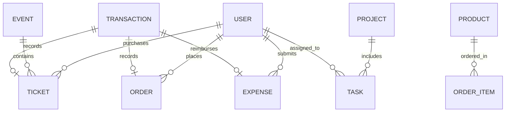
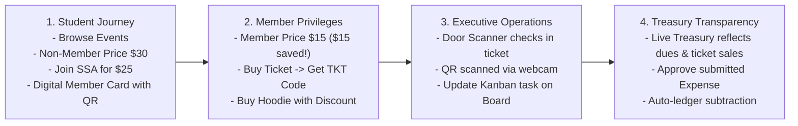

# 05. Work Division & Hackathon Execution Plan
## Skyline Student Association (SSA) — MERN Stack Project

> **Modular Execution Architecture for the Development Team**  
> **Architecture Pattern:** Division by Architectural Track (Core Backend vs. API Routes vs. Frontend Core vs. Feature Pages)  
> **Tech Stack:** React 18 (Vite, Tailwind CSS, Lucide Icons) | Node.js + Express | MongoDB + Mongoose  

---

## 1. Architectural Strategy & Modular Execution Tracks

> [!NOTE]
> **Team Flexibility:** These tracks are **modular packages**, not rigid personal silos. One developer can easily own the entire backend (combining Track 1 & Track 2), while other teammates divide frontend components and pages (Tracks 3 & 4), or swap around as needed. The tracks exist so code is partitioned cleanly by layer, preventing Git merge conflicts and keeping everyone aligned with the single source of truth.

In hackathon environments, dividing work **by feature** (e.g., Developer A builds Events end-to-end, Developer B builds Merch end-to-end) almost always fails due to:
1. Fragmented database connections, duplicate schemas, and inconsistent relationships.
2. Divergent API response shapes (`{ data: ... }` vs `{ result: ... }` vs raw arrays).
3. Mismatched UI components, inconsistent styling, and duplicate CSS configurations.
4. Broken Git merges when both developers modify the same server files.

Instead, the **Skyline Student Association** platform separates work into **4 clean architectural tracks**:



### Core Collaboration Tenets
1. **Parallel Execution via Contracts:** Backend tracks and Frontend tracks can start immediately at Hour 0 without blocking each other.
2. **Contract Is King:** The specification files (`02_DATABASE_SCHEMAS.md`, `03_API_ENDPOINTS.md`, `04_PAGES_AND_COMPONENTS.md`) represent the contract.
3. **Mock-First Frontend:** Track 4 can develop page layouts using Track 3's mock data dictionary, allowing frontend velocity to run unblocked while backend routes are wired up.
4. **Standard Envelope Guarantee:** Every single endpoint returns `{ success, data, message, errors }`. The frontend Axios client expects this exact structure.
5. **Contextual Event Management:** Global roles are `student`, `volunteer`, `treasurer`, `officer`. In addition, any member can be assigned as an **Event Manager** on a specific event via `event.managers: [ObjectId]`. On that event only, they have scoped admin permissions (edit details, scan tickets, view attendees). On other events, they are normal members.

---

## 2. Team Member Work Packages & Deliverables

---

### Track 1: Database & Backend Core Engine

#### Responsibilities
This track establishes the database models, server lifecycle, environment configuration, authentication/authorization middleware, unique code generation utilities, and the complete demo seeding script.

#### Deliverable Checklist
- [ ] `server/config/db.js` — MongoDB connection via Mongoose with auto-reconnect, error traps, and connection state logging.
- [ ] `server/server.js` — Express bootstrap, CORS policy, JSON body parsers (limit `10mb`), morgan logging, health check route `GET /api/health`, global error handler, and route mounting for all 11 domains.
- [ ] `server/models/User.js` — User model with password hashing hook (`bcryptjs`), role enums (`student`, `volunteer`, `treasurer`, `officer`), membership status (`none`, `active`, `expired`), and profile metadata.
- [ ] `server/models/Event.js` — Event model with multi-tier pricing (`memberPrice`, `nonMemberPrice`), venue/address, capacity counter, ticketsSold, status enums (`draft`, `published`, `cancelled`, `completed`), per-event `managers: [{ type: mongoose.Schema.Types.ObjectId, ref: 'User' }]` array, and `linkedProject`.
- [ ] `server/models/Ticket.js` — Ticket model referencing User and Event, containing unique `ticketCode` (`TKT-2026-XXXX`), `ticketType` (`member`, `non-member`), `price`, `status` (`valid`, `used`, `cancelled`), and `checkedInAt`.
- [ ] `server/models/Product.js` — Merch model with SKU, variant options (`size`, `color`), tiered pricing (`memberPrice`, `nonMemberPrice`), inventory count, and image URLs.
- [ ] `server/models/Order.js` — Order model with `orderNumber`, product ref, variant snapshot (`size`, `color`), quantity, totalPrice, and fulfillment status (`placed`, `confirmed`, `ready`, `collected`, `cancelled`).
- [ ] `server/models/Project.js` — Initiative model with status, lead reference, budget allocation, and target completion dates.
- [ ] `server/models/Task.js` — Kanban task model referencing Project, priority (`low`, `medium`, `high`), status (`todo`, `in_progress`, `done`), assignee, and due date.
- [ ] `server/models/Transaction.js` — Treasury ledger model recording every monetary inflow/outflow, category (`dues`, `ticket_sale`, `merch_sale`, `reimbursement`, `other`), payment reference, and balance impact.
- [ ] `server/models/Expense.js` — Reimbursement claim model with receipt attachments, requested amount, category, status (`submitted`, `approved`, `rejected`, `reimbursed`), and approval audit trail.
- [ ] `server/models/Announcement.js` — Public notice model with title, body, category (`meeting`, `deadline`, `update`, `urgent`), author reference, and emailSent flag.
- [ ] `server/middleware/auth.js` — JWT verification extracting token from `Authorization: Bearer <token>`, decoding user ID and role, fetching user, and injecting `req.user`.
- [ ] `server/middleware/roleCheck.js` — Role-based authorization middleware factory `authorizeRoles(...allowedRoles)` verifying role hierarchy and membership validity.
- [ ] `server/utils/generateCode.js` — Collision-resistant, formatted code generators for `ticketCode` (`TKT-2026-XXXX`) and `orderNumber` (`ORD-2026-XXXX`).
- [ ] `server/.env` & `server/.env.example` — Configuration keys (`PORT=5000`, `MONGO_URI`, `JWT_SECRET`, `JWT_EXPIRES_IN=7d`, `CLIENT_URL=http://localhost:5173`, `NODE_ENV=development`).
- [ ] `server/package.json` — Dependencies, devDependencies, and npm scripts (`start`, `dev`, `seed`).
- [ ] `server/seed.js` — Comprehensive seed script generating realistic demo data for the entire application.

#### Key Packages
```json
{
  "dependencies": {
    "bcryptjs": "^2.4.3",
    "cors": "^2.8.5",
    "dotenv": "^16.4.5",
    "express": "^4.19.2",
    "express-validator": "^7.0.1",
    "jsonwebtoken": "^9.0.2",
    "mongoose": "^8.3.1",
    "morgan": "^1.10.0",
    "multer": "^1.4.5-lts.1",
    "nanoid": "^3.3.7"
  },
  "devDependencies": {
    "nodemon": "^3.1.0"
  }
}
```

#### Code Specification & Signatures
```javascript
// server/utils/generateCode.js
export const generateTicketCode = () => {
  const chars = 'ABCDEFGHJKLMNPQRSTUVWXYZ23456789';
  let randomStr = '';
  for (let i = 0; i < 4; i++) {
    randomStr += chars.charAt(Math.floor(Math.random() * chars.length));
  }
  return `TKT-2026-${randomStr}`;
};

export const generateOrderNumber = () => {
  const chars = 'ABCDEFGHJKLMNPQRSTUVWXYZ23456789';
  let randomStr = '';
  for (let i = 0; i < 4; i++) {
    randomStr += chars.charAt(Math.floor(Math.random() * chars.length));
  }
  return `ORD-2026-${randomStr}`;
};
```

---

### Track 2: API Routes & Controllers

#### Responsibilities
This track turns data models into interactive REST endpoints. It handles request validation, controller business logic, error propagation, transaction ledger triggers, and guarantees adherence to `03_API_ENDPOINTS.md`.

#### Deliverable Checklist
- [ ] `server/routes/authRoutes.js` + `server/controllers/authController.js`:
  - `POST /api/auth/register` (student registration, validation, password hashing, JWT issue)
  - `POST /api/auth/login` (credential check, JWT issue)
  - `GET /api/auth/me` (current authenticated profile)
- [ ] `server/routes/memberRoutes.js` + `server/controllers/memberController.js`:
  - `GET /api/members` (officer view: search, filter by status, pagination)
  - `GET /api/members/:id` (member details, students can only view own)
  - `POST /api/members/pay-dues` (dues payment simulation, active membership activation, generates `Transaction` entry)
  - `PATCH /api/members/:id/role` (officer updates user role to student/volunteer/treasurer/officer)
  - `POST /api/members/:id/send-reminder` (officer sends simulated renewal reminder email)
- [ ] `server/routes/eventRoutes.js` + `server/controllers/eventController.js`:
  - `GET /api/events` (public list with query filters: category, status, sort, page, limit)
  - `GET /api/events/:id` (single event details with remaining ticket calculation & populated managers)
  - `POST /api/events` (officer event creation, optional linked project)
  - `PATCH /api/events/:id` (event updates — officer OR event manager for this event)
  - `DELETE /api/events/:id` (officer only — delete event)
  - `PATCH /api/events/:id/managers` (officer adds/removes event managers: `{ action: "add" | "remove", userId }`)
- [ ] `server/routes/ticketRoutes.js` + `server/controllers/ticketController.js`:
  - `POST /api/tickets` (ticket purchase, capacity decrement, generates `Transaction` entry, generates `TKT-2026-XXXX`)
  - `GET /api/tickets/my` (authenticated user's active/past tickets)
  - `GET /api/tickets/event/:eventId` (volunteer, treasurer, officer, OR event manager for this event)
  - `POST /api/tickets/scan` (door check-in scanner: volunteer, officer, OR event manager for ticket's event; marks used, sets `checkedInAt`)
- [ ] `server/routes/productRoutes.js` + `server/controllers/productController.js`:
  - `GET /api/products` (store listing, category filters, active flag)
  - `GET /api/products/:id` (product details with size/color variants)
  - `POST /api/products` (officer product creation with variants array)
  - `PATCH /api/products/:id` (officer product updates)
  - `PATCH /api/products/:id/stock` (officer updates specific variant stock: `{ variantIndex, stock }`)
- [ ] `server/routes/orderRoutes.js` + `server/controllers/orderController.js`:
  - `POST /api/orders` (checkout, stock decrement, member status check, generates `Transaction`, generates `ORD-2026-XXXX`)
  - `GET /api/orders/my` (user order history)
  - `GET /api/orders` (officer full order list)
  - `PATCH /api/orders/:id/status` (officer fulfillment status update: placed → confirmed → ready → collected)
- [ ] `server/routes/projectRoutes.js` + `server/controllers/projectController.js`:
  - `GET /api/projects` (list all projects with task count metrics)
  - `GET /api/projects/:id` (project details + all tasks populated)
  - `POST /api/projects` (officer creates project initiative)
  - `PATCH /api/projects/:id` (officer updates project)
- [ ] `server/routes/taskRoutes.js` + `server/controllers/taskController.js`:
  - `POST /api/tasks` (officer creates task)
  - `PATCH /api/tasks/:id` (volunteer updates own task status; officer updates any task field)
  - `DELETE /api/tasks/:id` (officer removes task)
- [ ] `server/routes/treasuryRoutes.js` + `server/controllers/treasuryController.js`:
  - `GET /api/treasury/summary` (treasurer/officer: total income, total expenses, net balance, category breakdown)
  - `GET /api/treasury/transactions` (treasurer/officer: filtered transaction ledger)
  - `POST /api/treasury/transactions` (treasurer/officer: manual cash transaction adjustment entry)
- [ ] `server/routes/expenseRoutes.js` + `server/controllers/expenseController.js`:
  - `POST /api/expenses` (volunteer/treasurer/officer submits reimbursement claim with receipt)
  - `GET /api/expenses/my` (user's submitted claims)
  - `GET /api/expenses` (treasurer/officer approval queue)
  - `PATCH /api/expenses/:id/review` (treasurer/officer approves or rejects claim with reason)
  - `PATCH /api/expenses/:id/reimburse` (treasurer/officer reimburses claim; auto-creates negative `Transaction` in treasury)
- [ ] `server/routes/announcementRoutes.js` + `server/controllers/announcementController.js`:
  - `GET /api/announcements` (public feed, sorted by date desc)
  - `POST /api/announcements` (officer announcement publishing, optional simulated email blast)
  - `DELETE /api/announcements/:id` (officer removes announcement)

#### Standard Response Format
Every controller method **must** strictly use the helper response format:
```javascript
// Success envelope
res.status(200).json({
  success: true,
  data: resultData,
  message: "Operation completed successfully",
  errors: []
});

// Error envelope
res.status(400).json({
  success: false,
  data: null,
  message: "Invalid request payload",
  errors: [{ field: "email", message: "Email is already registered" }]
});
```

---

### Track 3: Frontend Core & UI Components

#### Responsibilities
This track sets up the React client, designs the design system and Tailwind theme, builds all layout structures, creates the global authentication context, authors all domain API service wrappers, and packages reusable UI/shared widgets.

#### Deliverable Checklist
- [ ] `client/` Vite + React project setup with React Router v6.
- [ ] `client/tailwind.config.js` — Skyline branding theme (Royal Blue `#1E40AF`, Sky Blue `#0284C7`, Amber `#F59E0B`, Emerald `#10B981`, Slate neutrals `#0F172A`).
- [ ] `client/src/main.jsx` & `client/src/App.jsx` — Complete route table with public, protected member, and protected executive/admin route wrappers.
- [ ] `client/src/context/AuthContext.jsx` — Global provider exposing `user`, `token`, `login()`, `logout()`, `register()`, `isMember`, `isAdmin`, `isExecutive`, and profile refresh.
- [ ] `client/src/hooks/useAuth.js` — Context hook with defensive checks.
- [ ] `client/src/services/api.js` — Axios client with base URL `http://localhost:5000/api`, request JWT interceptor, and response error unwrapper.
- [ ] `client/src/services/*.js` — API caller files for every domain:
  - `authService.js`, `memberService.js`, `eventService.js`, `ticketService.js`, `productService.js`, `orderService.js`, `projectService.js`, `taskService.js`, `treasuryService.js`, `expenseService.js`, `announcementService.js`.
- [ ] `client/src/components/ui/*.jsx` — Foundational components:
  - `Button.jsx` (variants: primary, secondary, outline, danger, ghost; sizes: sm, md, lg; loading spinner prop)
  - `Modal.jsx` (accessible backdrop, ESC key listener, title header, body slot, footer actions)
  - `Card.jsx` (`Card`, `CardHeader`, `CardTitle`, `CardDescription`, `CardContent`, `CardFooter`)
  - `Badge.jsx` (variants: default, success, warning, danger, info, outline)
  - `Input.jsx` (label, helper text, error text, prefix icon, disabled state)
  - `Select.jsx` (options array, placeholder, label, error state)
  - `Textarea.jsx` (character limit counter, resize controls, error state)
- [ ] `client/src/components/layout/*.jsx` — Shell components:
  - `Navbar.jsx` (Skyline logo, navigation links, quick action buttons, user profile pill, role badges)
  - `Sidebar.jsx` (responsive sidebar for admin/portal views, active route highlighters)
  - `Footer.jsx` (SSA mission statement, social links, quick portal links, copyright)
  - `PageWrapper.jsx` (max-w-7xl container, responsive padding, breadcrumbs slot)
- [ ] `client/src/components/shared/*.jsx` — Specialized hackathon widgets:
  - `QRCodeDisplay.jsx` (wraps `qrcode.react`, downloadable PNG button, custom SVG styling)
  - `QRScanner.jsx` (wraps `html5-qrcode`, camera selector, scan success beep/callback, camera switch)
  - `KanbanBoard.jsx` (column layout: To Do, In Progress, In Review, Done; task cards with quick move buttons)
  - `StatusBadge.jsx` (visual mapping for all system statuses: `active`, `pending`, `expired`, `fulfilled`, etc.)
  - `RoleBadge.jsx` (visual pill for `student`, `member`, `executive`, `admin`)
  - `StepIndicator.jsx` (visual multi-step indicator for membership joining, checkout, expense submission)
  - `StatCard.jsx` (metric value, title, icon, change indicator +12%, subtle gradient background)
  - `DataTable.jsx` (pagination, search filter, header sort, empty state slot, action column)
  - `EmptyState.jsx` (SVG illustration, title, description, primary action button)
  - `LoadingSpinner.jsx` (spinner in sm, md, lg, and full-page glass overlay)
  - `Toast.jsx` (toast notification manager for success, error, warning messages)
  - `ConfirmDialog.jsx` (confirmation modal for destructive actions: delete event, cancel ticket)
  - `PageHeader.jsx` (title, description, breadcrumbs, action button slot)
- [ ] `client/src/utils/formatDate.js` (relative "2 hours ago", short "Oct 24", full "Oct 24, 2026 6:00 PM").
- [ ] `client/src/utils/formatCurrency.js` (`Intl.NumberFormat('en-US', { style: 'currency', currency: 'USD' })`).
- [ ] `client/src/utils/constants.js` (Enum keys, category lists, default values, navigation items).
- [ ] `client/src/utils/mockData.js` (Complete fallback mock fixtures matching models exactly).

#### Key Packages
```json
{
  "dependencies": {
    "axios": "^1.6.8",
    "clsx": "^2.1.0",
    "html5-qrcode": "^2.3.8",
    "lucide-react": "^0.368.0",
    "qrcode.react": "^3.1.0",
    "react": "^18.2.0",
    "react-dom": "^18.2.0",
    "react-router-dom": "^6.22.3",
    "tailwind-merge": "^2.2.2"
  },
  "devDependencies": {
    "@vitejs/plugin-react": "^4.2.1",
    "autoprefixer": "^10.4.19",
    "postcss": "^8.4.38",
    "tailwindcss": "^3.4.3",
    "vite": "^5.2.8"
  }
}
```

---

### Track 4: Frontend Pages & Feature Views

#### Responsibilities
This track builds all end-user and administrative page views, binds them with Track 3's UI components and API services, manages client-side form validation, orchestrates route security guards, and leads end-to-end integration testing.

#### Deliverable Checklist
- [ ] `client/src/pages/Home/HomePage.jsx` — Hero section with CTA, featured upcoming events grid, pinned announcements carousel/feed, membership value proposition, stat highlights.
- [ ] `client/src/pages/Auth/LoginPage.jsx` — Clean login card, student email input, password input, validation, login dispatch, redirect to previous location.
- [ ] `client/src/pages/Auth/RegisterPage.jsx` — Student onboarding form (name, email, password, studentId, major, graduationYear), error messages, instant sign-in.
- [ ] `client/src/pages/Membership/JoinPage.jsx` — Membership tier showcase ($25/year), benefit list (discounted tickets, merch discounts, voting rights), simulated payment form, instant membership badge activation.
- [ ] `client/src/pages/Membership/MemberCardPage.jsx` — Virtual Student Association ID card with live `QRCodeDisplay`, student photo/avatar, membership ID, valid dates, print/save capability.
- [ ] `client/src/pages/Membership/MemberDirectoryPage.jsx` (Admin/Exec) — `DataTable` showing all members, status filter (`active`, `expired`, `pending`), search by name/ID, quick action to renew/revoke.
- [ ] `client/src/pages/Events/EventsListPage.jsx` — Event catalog with category filter tabs, search bar, event cards with dual pricing (`Member: $10` / `Guest: $20`), sold-out badges.
- [ ] `client/src/pages/Events/EventDetailPage.jsx` — Hero banner, event agenda, venue location map placeholder, remaining capacity counter, ticket tier selector, purchase modal.
- [ ] `client/src/pages/Events/CreateEventModal.jsx` (Admin/Exec) — Event creation form with image URL input, multi-tier pricing inputs, capacity setter, date/time pickers.
- [ ] `client/src/pages/Events/MyTicketsPage.jsx` — User's ticket wallet, card list showing upcoming vs. past events, "Show QR Code" modal button, download PDF/ticket view.
- [ ] `client/src/pages/Events/DoorScannerPage.jsx` (Admin/Exec) — Door check-in station utilizing `QRScanner`, live camera feed, scan result feedback (Green = Valid, Red = Already Used/Invalid), manual code input fallback, live check-in tally.
- [ ] `client/src/pages/Merch/MerchStorePage.jsx` — Merch store with category filters, product cards displaying member discount tags, stock availability indicator.
- [ ] `client/src/pages/Merch/ProductDetailPage.jsx` — Product image gallery, size selector (S, M, L, XL), color options, quantity selector, add-to-cart or express checkout button.
- [ ] `client/src/pages/Merch/MyOrdersPage.jsx` — User order history with expandable line items, order tracking badge (`pending`, `paid`, `fulfilled`), total price.
- [ ] `client/src/pages/Merch/ManageOrdersPage.jsx` (Admin/Exec) — Fulfillment dashboard, order search, status dropdown updater with immediate UI update.
- [ ] `client/src/pages/Merch/ManageInventoryPage.jsx` (Admin/Exec) — Product inventory grid, stock editor modal, create product button.
- [ ] `client/src/pages/Projects/ProjectsListPage.jsx` — Student association project initiatives overview, team lead info, progress bar, budget utilization metric.
- [ ] `client/src/pages/Projects/ProjectBoardPage.jsx` — Interactive Kanban project board, column filters, create task modal, task detail modal, quick status change buttons.
- [ ] `client/src/pages/Treasury/TreasuryDashboardPage.jsx` (Admin/Exec) — Executive financial summary cards (Balance, Revenue, Expenses), ledger `DataTable` with category filter and search, export button.
- [ ] `client/src/pages/Expenses/SubmitExpensePage.jsx` — Reimbursement claim form, expense category selector, amount input, receipt image URL, justification text.
- [ ] `client/src/pages/Expenses/ManageExpensesPage.jsx` (Admin/Exec) — Approval queue, pending claim cards, receipt preview modal, Approve/Reject action buttons with note input.
- [ ] `client/src/pages/Announcements/AnnouncementsPage.jsx` — Chronological notice board, pinned announcements pinned at top, category pill filters, read more modal.
- [ ] `client/src/pages/Announcements/PostAnnouncementModal.jsx` (Admin/Exec) — Publishing modal with title, rich content textarea, category selector, pin toggle.

---

## 3. Team Collaboration Protocols & Rules of Engagement

### Rule 1: Layered Sequencing & Dependencies
The team strictly adheres to the dependency order below. No one idles waiting for others; mock data bridges all early phase dependencies.



---

### Rule 2: Contract Is King & Field Name Consistency
Zero tolerance for field name deviations. AI assistants frequently alternate between `camelCase` and `snake_case` or invent field synonyms. All 4 team members must enforce the exact names listed below:

| Conceptual Item | STRICT Required Field Name | FORBIDDEN Aliases (Do NOT Use) |
| :--- | :--- | :--- |
| Membership Status | `membershipStatus` | `membership_status`, `memberStatus`, `memStatus` |
| Student ID Number | `studentId` | `student_id`, `sid`, `student_number` |
| Ticket Code | `ticketCode` | `ticket_code`, `code`, `tktCode` |
| Order Number | `orderNumber` | `order_number`, `orderCode`, `invoiceNumber`, `order_num` |
| Member Ticket Price | `memberPrice` | `member_price`, `discountPrice` |
| Non-Member Price | `nonMemberPrice` | `non_member_price`, `guestPrice`, `regularPrice` |
| Product Base Price | `basePrice` | `base_price`, `price`, `unitPrice` |
| Task Assignee | `assignee` | `assignedTo`, `user_assigned`, `memberId` |
| Task Status | `status` (`todo`, `in_progress`, `done`) | `state`, `task_status`, `column` |
| Ticket Status | `status` (`valid`, `used`, `cancelled`) | `isUsed`, `used`, `ticket_state` |
| Ticket Check-in | `checkedInAt` (Date) | `checkInTime`, `scannedAt`, `checkin_date` |
| Expense Category | `category` (`supplies`, `food`, etc.) | `expenseCategory`, `cat`, `expense_type` |

---

### Rule 3: Git Branching & Merge Protocol
To prevent branch drift and merge conflicts:
- **Default Branch:** `main` (always runnable, always deployable).
- **Track Feature Branches:**
  - Backend Core: `feature/backend-core`
  - API Routes: `feature/api-routes`
  - Frontend Core: `feature/frontend-core`
  - Frontend Pages: `feature/frontend-pages`
- **Cadence:** Commit working chunks and merge into `main` every **2 to 3 hours**.
- **Merge Order:**
  1. Backend Core merges into `main`.
  2. Frontend Core merges into `main`.
  3. All teammates immediately pull `main` (`git pull origin main`).
  4. API Routes merges into `main`.
  5. Frontend Pages merges into `main`.
- **Pre-Merge Self-Check:**
  - Backend: `node server/server.js` starts with 0 errors.
  - Frontend: `npm run build` completes with 0 JSX/Tailwind compilation errors.

---

### Rule 4: Standard API Envelope Contract
All backend controllers (Track 2) consumed by the frontend (Tracks 3 & 4) must resolve to this standard JSON envelope:

```typescript
// Standard Interface Representation
interface ApiResponse<T> {
  success: boolean;       // true on 2xx, false on 4xx/5xx
  data: T | null;         // Payload object, array, or null
  message: string;        // Human-friendly feedback message
  errors?: Array<{        // Optional validation or field errors
    field?: string;
    message: string;
  }>;
}
```

Axios interceptor configured in Track 3:
```javascript
// client/src/services/api.js
import axios from 'axios';

const api = axios.create({
  baseURL: import.meta.env.VITE_API_URL || 'http://localhost:5000/api',
  headers: { 'Content-Type': 'application/json' }
});

api.interceptors.request.use((config) => {
  const token = localStorage.getItem('token');
  if (token) {
    config.headers.Authorization = `Bearer ${token}`;
  }
  return config;
});

api.interceptors.response.use(
  (response) => response.data, // Unwraps outer Axios object, returns { success, data, message }
  (error) => {
    const errorPayload = error.response?.data || {
      success: false,
      data: null,
      message: error.message || 'An unexpected error occurred'
    };
    return Promise.reject(errorPayload);
  }
);

export default api;
```

---

### Rule 5: Parallel Development via Mock Data (`mockData.js`)
### Rule 5: Parallel Development via Mock Data (`mockData.js`)
Frontend development must never wait for backend deployment. The file `client/src/utils/mockData.js` provides complete offline fixtures:
- `mockUser`: Student, Member, Volunteer, Treasurer, and Officer user objects.
- `mockEvents`: Array of 4 events (Gala, Fundraiser, Meeting, Workshop) with manager IDs.
- `mockTickets`: Array of tickets with valid `ticketCode` and `ticketType`.
- `mockProducts`: Array of merch items with sizes, colors, and stock.
- `mockOrders`: Array of orders with populated line items and status pills.
- `mockProjects` & `mockTasks`: Array of initiatives and Kanban tasks.
- `mockTreasurySummary` & `mockTransactions`: Balance metrics and ledger items.
- `mockExpenses`: Array of claims with receipt URLs and review states.
- `mockAnnouncements`: Array of notices with tags.

Every frontend service can toggle mock mode with a single variable:
```javascript
// Example: client/src/services/eventService.js
import api from './api';
import { mockEvents } from '../utils/mockData';

const USE_MOCK = false; // Toggle to true during local offline frontend dev

export const eventService = {
  getAll: async (params) => {
    if (USE_MOCK) return { success: true, data: mockEvents, message: 'Mock data loaded' };
    return await api.get('/events', { params });
  },
  getById: async (id) => {
    if (USE_MOCK) {
      const event = mockEvents.find(e => e._id === id);
      return { success: true, data: event, message: 'Mock data loaded' };
    }
    return await api.get(`/events/${id}`);
  }
};
```

---

### Rule 6: AI Coding Assistant Prompt Engineering Protocols
When prompting AI assistants (Claude, ChatGPT, GitHub Copilot, Cursor), **never give vague instructions**. Always supply the exact specification snippet from the context docs.

#### AI Prompt Template: Backend Model (Track 1)
```text
Act as a Senior Node.js/Mongoose Engineer for the Skyline Student Association project.
Create the Mongoose model file: server/models/[ModelName].js.
Requirements:
1. Adhere strictly to the schema definition from 02_DATABASE_SCHEMAS.md:
[PASTE EXACT SCHEMA SECTION HERE]
2. Use camelCase for all field names. No exceptions.
3. Include timestamps: true.
4. Export the Mongoose model as default.
5. Do NOT invent new fields or modify enum strings.
```

#### AI Prompt Template: API Controller & Route (Track 2)
```text
Act as an Express.js Backend Architect for the Skyline Student Association project.
Create the route server/routes/[domain]Routes.js and controller server/controllers/[domain]Controller.js.
Requirements:
1. Follow the API specification from 03_API_ENDPOINTS.md:
[PASTE EXACT ENDPOINT SECTION HERE]
2. All responses must strictly adhere to the standard envelope:
   { success: true, data: ..., message: "...", errors: [] }
3. Wrap all database operations in try/catch and pass errors to next(error).
4. Use express-validator for incoming body validations.
5. Protect sensitive routes with auth and authorizeRoles middleware.
```

#### AI Prompt Template: UI & Shared Component (Track 3)
```text
Act as a Frontend Component Architect using React 18 and Tailwind CSS.
Create the reusable component: client/src/components/[ui|shared]/[ComponentName].jsx.
Requirements:
1. Component must be pure, accessible, and accept standard Tailwind className overrides.
2. Use Lucide-react for icons.
3. Component prop interface:
[PASTE PROPS SPECIFICATION HERE]
4. Provide sensible defaults for all optional props.
5. Avoid hardcoded text; allow children or custom labels.
```

#### AI Prompt Template: Page Component (Track 4)
```text
Act as a Frontend Application Developer for Skyline Student Association.
Create the page component: client/src/pages/[Domain]/[PageName].jsx.
Requirements:
1. Adhere to the UX and component layout from 04_PAGES_AND_COMPONENTS.md:
[PASTE PAGE SPECIFICATION HERE]
2. Use UI components from client/src/components/ui/ and client/src/components/shared/.
3. Fetch data using [domain]Service from client/src/services/[domain]Service.js.
4. Use useAuth() hook from client/src/hooks/useAuth for role and user state.
5. Handle all 4 UI states gracefully: Loading (LoadingSpinner), Error (Toast/Alert), Empty (EmptyState), and Success.
```

---

## 4. Realistic Demo Data Seeding Specification (`server/seed.js`)

The `server/seed.js` script drops existing collections and reseeds realistic, interconnected records ready for the hackathon judging demo:



### Seeding Target Counts & Archetypes
1. **Users (12 accounts):**
   - 1 Super Admin (`admin@skyline.edu`, password `Password123!`)
   - 2 Executives (`president@skyline.edu`, `treasurer@skyline.edu`)
   - 5 Active Members with valid student IDs and `active` membership status
   - 2 Expired Members (`expired` status)
   - 2 Regular Non-Member Students (`student` role, `none` membership status)
2. **Events (4 records):**
   - "Skyline Annual Tech Gala" (Upcoming, Paid: Member $15 / Non-Member $30, capacity 200)
   - "HackSkyline 2026 Hackathon" (Upcoming, Free: Member $0 / Non-Member $0, capacity 150)
   - "Alumni Career Panel & Mixer" (Upcoming, Paid: Member $5 / Non-Member $15, capacity 80)
   - "Fall Orientation Social" (Past Completed event, 120 attendees)
3. **Tickets (24 records):**
   - 18 Valid unused tickets across upcoming events with codes `TKT-2026-A101` through `TKT-2026-A118` and valid QR payloads.
   - 4 Already-used tickets with `used: true` and `checkInTime` set.
   - 2 Cancelled tickets.
4. **Products (5 items with variants):**
   - "SSA Signature Navy Hoodie" (Sizes: S, M, L, XL; Member: $35, Non-Member: $45; 45 in stock)
   - "Skyline Stainless Steel Thermal Bottle" (Color: Matte Black, Navy; Member: $18, Non-Member: $24; 60 in stock)
   - "SSA Embroidered Dad Cap" (Color: Navy, Khaki; Member: $15, Non-Member: $20; 30 in stock)
   - "HackSkyline 2026 Commemorative T-Shirt" (Sizes: S, M, L, XL; Member: $12, Non-Member: $18; 80 in stock)
   - "SSA Laptop Sticker Pack (5-Pack)" (Member: $4, Non-Member: $6; 150 in stock)
5. **Orders (10 records):**
   - 4 `fulfilled` orders with complete addresses and past payment timestamps.
   - 4 `paid` orders ready for demo fulfillment in the Admin panel.
   - 2 `pending` orders.
6. **Projects & Tasks (2 Projects, 18 Tasks):**
   - Project 1: "Annual HackSkyline 2026 Execution" (Lead: President, Budget: $4,500)
     - 10 Tasks distributed across `todo` (3), `in_progress` (3), `review` (2), `done` (2).
   - Project 2: "Spring Merchandise Rebrand" (Lead: VP Marketing, Budget: $1,200)
     - 8 Tasks distributed across Kanban columns.
7. **Treasury Transactions (18 ledger rows):**
   - Inflows from Membership Dues ($25 x 5 = $125).
   - Inflows from Ticket Sales ($15 x 18 = $270).
   - Inflows from Merch Sales ($350).
   - Inflow from University Student Government Grant ($5,000).
   - Outflows from Venue Booking Deposit (-$1,200).
   - Outflows from Approved Expenses (-$350).
   - Starting Treasury Balance: ~$4,195.00.
8. **Expenses (6 records):**
   - 2 `reimbursed` claims with receipt links and transaction records.
   - 2 `approved` claims ready for treasury payout demo.
   - 2 `submitted` claims waiting in the review queue.
9. **Announcements (5 notices):**
   - 2 Pinned: "Welcome to Skyline Student Association 2026-2027!" and "HackSkyline Registration Now Live!"
   - 3 Regular notices covering office hours, merch discounts, and election timelines.

---

## 5. Hour-by-Hour 2-Day Hackathon Execution Plan

```mermaid
gantt
    title Hackathon 20-Hour Timeline
    dateFormat X
    axisFormat Hour %H

    section Track 1 (Backend Core)
    DB Config & Models        :0, 2
    Seed Script & Auth Guards :2, 4
    Model Refinement & Test   :4, 6
    Controller Assist         :6, 8
    Ledger Sync Verification  :8, 10
    Perf & Query Tuning       :10, 12
    Demo Data Hardening       :12, 14
    Full System Testing       :14, 16
    Deployment Prep           :16, 18
    Demo Rehearsal            :18, 20

    section Track 2 (API/Routes)
    Endpoint Specs Review     :0, 2
    Auth & Member Routes      :2, 4
    Event & Ticket Routes     :4, 6
    Product & Order Routes    :6, 8
    Project & Task Routes     :8, 10
    Treasury & Expense Routes :10, 12
    Announcement Routes       :12, 14
    Error Handling Hardening  :14, 16
    Deployment Prep           :16, 18
    Demo Rehearsal            :18, 20

    section Track 3 (FE Core)
    Vite + Tailwind + Router  :0, 2
    Base UI Components        :2, 4
    Layouts + Axios Services  :4, 6
    Shared Widgets (QR/Kanban):6, 8
    API Integration Layer     :8, 10
    Responsive & Theme Polish :10, 12
    Toast & Loading States    :12, 14
    Component Edge Cases      :14, 16
    Deployment Prep           :16, 18
    Demo Rehearsal            :18, 20

    section Track 4 (Pages)
    Page Scaffolding          :0, 2
    Home & Auth Pages         :2, 4
    Member & Event List Pages :4, 6
    Event Detail & Merch Shop :6, 8
    QR Scanner & Tickets Page :8, 10
    Project Board & Treasury  :10, 12
    Expenses & Announcements  :12, 14
    Admin Management Pages    :14, 16
    End-to-End Bug Squashing  :16, 18
    Demo Rehearsal            :18, 20
```



---

### Day 1: Foundation, Parallel Build & Core Flow (Hours 0 – 10)

| Hour Window | Track 1: DB & Core | Track 2: API & Routes | Track 3: Frontend Core | Track 4: Pages & Views | Milestone Checkpoint |
| :--- | :--- | :--- | :--- | :--- | :--- |
| **H 00 – 02** | Initialize repo, `db.js`, Express server, User, Event, Ticket models, auth middleware | Study `03_API_ENDPOINTS.md`, setup route stubs & validation skeletons | Vite + React setup, Tailwind config, React Router v6, `AuthContext.jsx` base | Review page specs, scaffold page folder hierarchy, wire dummy routes in `App.jsx` | **Checkpoint 1:** Server connects to MongoDB. Vite dev server runs. Router renders stub pages. |
| **H 02 – 04** | Product, Order, Project, Task models; code generator utilities | Implement `authRoutes` (login, register, me) & `memberRoutes` (join, card) | Build `Button`, `Input`, `Card`, `Badge`, `Modal`, `Select`, `Textarea` UI components | Build `HomePage.jsx`, `LoginPage.jsx`, `RegisterPage.jsx` using Track 3 UI components | **Checkpoint 2:** User can register and login. Token saves to localStorage. Home & Auth pages look clean. |
| **H 04 – 06** | Transaction, Expense, Announcement models; review indexes & relations | Implement `eventRoutes` & `ticketRoutes` with capacity validation & purchase logic | Build `Navbar`, `Sidebar`, `Footer`, `PageWrapper`; write `api.js` + services | Build `JoinPage.jsx`, `MemberCardPage.jsx`, `EventsListPage.jsx` | **Checkpoint 3:** Full membership join flow working. Events list rendering cards with member pricing. |
| **H 06 – 08** | Write initial draft of `seed.js`; assist on business logic & relations | Implement `productRoutes` & `orderRoutes` (stock decrements, discount checks) | Build `QRCodeDisplay`, `QRScanner`, `KanbanBoard`, `StatusBadge`, `DataTable` | Build `EventDetailPage.jsx`, `CreateEventModal.jsx`, `MerchStorePage.jsx`, `ProductDetailPage.jsx` | **Checkpoint 4:** Event tickets can be purchased. Merch store displays products with variants. |
| **H 08 – 10** | Verify ledger hooks (membership dues, tickets, orders generate transactions) | Implement `projectRoutes` & `taskRoutes` (Kanban column updates, assignments) | Test API services against live endpoints; wire Axios error interceptors | Build `MyTicketsPage.jsx`, `DoorScannerPage.jsx`, `MyOrdersPage.jsx` | **Checkpoint 5 (Day 1 Wrap):** QR code renders on ticket. Door scanner scans camera feed. Day 1 demo works! |

---

### Day 2: Advanced Modules, Admin Views, Hardening & Demo Prep (Hours 10 – 20)

| Hour Window | Track 1: DB & Core | Track 2: API & Routes | Track 3: Frontend Core | Track 4: Pages & Views | Milestone Checkpoint |
| :--- | :--- | :--- | :--- | :--- | :--- |
| **H 10 – 12** | Database indexing, optimize queries, fix model validation quirks | Implement `treasuryRoutes` & `expenseRoutes` (submission, approvals, auto-transactions) | Build `StatCard`, `StepIndicator`, `Toast` notifications, responsive mobile fixes | Build `ProjectBoardPage.jsx` (Kanban), `TreasuryDashboardPage.jsx` | **Checkpoint 6:** Interactive Kanban drag/move works. Treasury dashboard renders balance & charts. |
| **H 12 – 14** | Execute full `seed.js` script with all 12 users, 4 events, 24 tickets, merch, tasks | Implement `announcementRoutes`; write comprehensive error handling for edge cases | Finalize all loading overlays, skeleton loaders, and empty state illustrations | Build `SubmitExpensePage.jsx`, `ManageExpensesPage.jsx`, `AnnouncementsPage.jsx` | **Checkpoint 7:** Expense claims can be submitted, approved, and immediately reflect in Treasury. |
| **H 14 – 16** | End-to-end data integrity audit; clean orphan records; verify transactions balance | Assist frontend with route params, pagination, and filter queries | Polish component UI, fix dark/light contrast, add button sound/toast alerts | Build admin views: `ManageOrdersPage.jsx`, `ManageInventoryPage.jsx`, `MemberDirectoryPage.jsx` | **Checkpoint 8:** Admin fulfillment dashboard works. All 23 pages are reachable and functional. |
| **H 16 – 18** | Environment configuration for staging/production; DB connection string freeze | Fix any controller edge-case errors; verify CORS and rate limits | Production build check (`npm run build`), resolve bundle warnings | Full walkthrough test of all 4 roles (Student, Member, Exec, Admin) | **Checkpoint 9: CODE FREEZE.** Zero new feature code. Application completely stable on main branch. |
| **H 18 – 20** | Run `npm run seed` to reset to pristine demo state; assist demo script | Back up database state; stand by for backend health checks | Polish presentation visuals; prepare demo browser tabs and mobile view | **Demo Rehearsal:** Run through 5-minute judge presentation script 3 times seamlessly. |

---

## 6. Live Demo Script & Presentation Flow

For a 5-minute hackathon judging demonstration, execute this scripted flow:



### Presentation Script Breakdown (Total: 5 Minutes)
1. **Minute 0:00 – 01:00 | The Problem & The Student Journey**
   - Open on `HomePage.jsx` as a guest student.
   - Show upcoming "Skyline Annual Tech Gala" — ticket price is **$30.00**.
   - Navigate to `JoinPage.jsx` — pay $25 dues to become an active SSA member.
   - Reveal instant digital membership card on `MemberCardPage.jsx` with unique student QR code and "Active Member" badge.
2. **Minute 01:00 – 02:00 | Member Value & Event Ticketing**
   - Return to "Skyline Annual Tech Gala" — ticket price dynamically drops to **$15.00 (Member Discount)**.
   - Purchase ticket — instant checkout generating `TKT-2026-A101`.
   - Open `MyTicketsPage.jsx` showing the ticket with its scannable QR code.
   - Hop over to `MerchStorePage.jsx` — demonstrate member discount applied to the "SSA Signature Navy Hoodie".
3. **Minute 02:00 – 03:15 | Executive Tools & Door Scanning**
   - Log in as Officer (`president@skyline.edu`).
   - Open `DoorScannerPage.jsx` on laptop webcam.
   - Hold up the attendee's ticket QR code from mobile/another screen.
   - **BEEP!** Screen flashes Green: *"Valid Ticket: Skyline Annual Tech Gala - Attendee Verified"*.
   - Scan it a second time — Screen flashes Red: *"Already Checked In at 7:14 PM"*.
   - Switch to `ProjectBoardPage.jsx` — move task *"Coordinate Audio/Visual Setup"* from **In Progress** to **Done**.
4. **Minute 03:15 – 04:30 | Automated Treasury & Financial Integrity**
   - Open `TreasuryDashboardPage.jsx`.
   - Show live balance ($4,195.00) with visual inflows from the membership dues ($25.00) and ticket sale ($15.00) executed 2 minutes ago.
   - Navigate to `ManageExpensesPage.jsx` — show pending expense claim for *"Catering Deposit - $350.00"*.
   - Click **Approve & Reimburse**.
   - Return immediately to `TreasuryDashboardPage.jsx` — balance has decremented to $3,845.00 with an itemized audit ledger row.
5. **Minute 04:30 – 05:00 | Architecture & Technical Wrap-up (All)**
   - Highlight clean layer separation, zero-flicker React state, Mongoose relational consistency, and security guards.
   - Open floor to judges' Q&A.

---

## 7. Emergency Protocols & Triage Matrix

When unexpected blockers happen under hackathon time pressure, follow this triage guide:

| Emergency Scenario | Immediate Action & Workaround | Owner |
| :--- | :--- | :--- |
| **Camera permissions fail on QR Scanner** | Use the manual code fallback input in `DoorScannerPage.jsx` (`TKT-2026-A101`) to trigger verification. | Frontend |
| **Backend API deployment or CORS failure** | Toggle `USE_MOCK = true` in frontend services. Frontend demo runs 100% flawlessly off `mockData.js`. | Frontend |
| **MongoDB connection drops or network lag** | Switch connection string in `server/.env` to local `mongodb://localhost:27017/skyline_ssa`. | Backend |
| **An endpoint is running late** | Use mock responses for that specific service while the controller is being finalized. | Frontend / Backend |
| **Merge conflict 1 hour before demo** | Hard-reset branch to `main`, reapply the specific component file using `git checkout`, avoid touching shared routers. | Team |
| **Demo data corrupted during testing** | Run `npm run seed` in `server/` to repopulate the complete, clean demo database in 3 seconds. | Backend |

---

## 8. Summary Checklist Before Demo Presentation

- [ ] All 12 seed users can log in with their respective roles.
- [ ] At least one event ticket has been purchased and exists in `MyTicketsPage.jsx`.
- [ ] Door scanner successfully decodes QR code or accepts manual ticket code.
- [ ] Membership join flow updates `isMember` state without requiring a browser refresh.
- [ ] Treasury dashboard reflects real calculated totals from `transactions` collection.
- [ ] Responsive navigation works smoothly on both laptop and mobile viewport widths.
- [ ] Both server (`npm run dev`) and client (`npm run dev`) run in separate terminals with zero console crashes.
- [ ] Browser console on client has zero unhandled React/Axios runtime errors.
